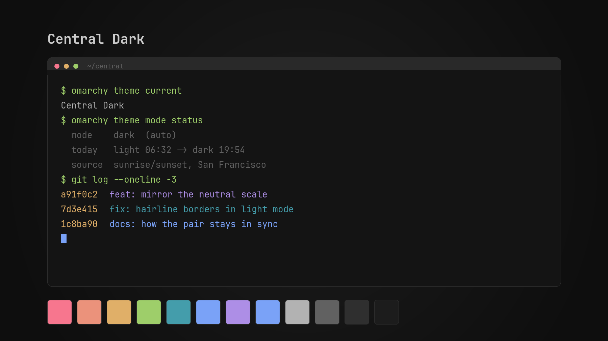

# Central Dark

A neutral-grey Omarchy theme. The greys are pure (dark side of the Central
scale); the accents are the Tokyo Night family. It is one half of a pair —
its counterpart is **[Central Light](https://github.com/yitongzhang/omarchy-central-light-theme)** —
and the two are designed to be swapped at sunrise and sunset by
[omarchy-theme-mode](https://github.com/yitongzhang/omarchy-theme-mode).



## Install

```bash
omarchy theme install https://github.com/yitongzhang/omarchy-central-dark-theme.git
```

For the pair plus automatic day/night switching and a bar toggle, install
[omarchy-theme-mode](https://github.com/yitongzhang/omarchy-theme-mode) instead —
it pulls both themes in.

## What's in here, and what deliberately isn't

```
colors.toml        the palette, plus mode and the Hyprland border gradients
shell.bar.toml     the whole [bar] section — identical in both halves
icons.theme        Yaru-blue-dark (the dark-UI variant — light symbolic glyphs)
partner.theme      central-light — read by omarchy-theme-mode to find the other half
backgrounds/       one wallpaper
preview.png        rendered by ./make-preview.sh from colors.toml
```

There is **no** `alacritty.toml`, `neovim.lua`, `vscode.json`, `btop.theme`,
`hyprland.lua`, `ghostty.conf`, `shell.toml` or friends, and that is the point.

`omarchy-theme-set-templates` renders every one of those from
`$OMARCHY_PATH/default/themed/*.tpl` using this `colors.toml` — but it skips
any file the theme already ships. A checked-in `vscode.json` would therefore
be frozen at whatever Omarchy's template looked like the day it was copied,
and would never pick up a fix or a newly supported app again.

So the rule for this theme is: **express it in `colors.toml` if it can
possibly be expressed there.** Two things that look like they need a static
file but don't:

- **Window borders.** `hyprland_active_border` / `hyprland_inactive_border`
  in `colors.toml` feed both `hyprland.lua.tpl` and the shell's
  popup/menu/notification/lock borders. No `hyprland.lua` needed.
- **Menu, popup, notification and lock borders.** They all resolve from the
  same `hyprland.active-border` token, so the two keys above style them too.
  No `shell.toml` needed for any of it.

### The one exception: `shell.bar.toml`

`shell.<section>.toml` **replaces** a section — it does not merge into it. So
`shell.bar.toml` has to spell out every `[bar]` key, including the four it
doesn't change, and those four are frozen against upstream until someone
updates this file.

That trade is deliberate and narrow. The bar's weight is a real part of this
theme's identity and there is no per-key theme-level override to express it
with.

Note that `shell.bar.toml` is **identical** in Central Dark and Central Light.
The bar is not desktop chrome that should invert with the mode — it floats
over the wallpaper, and the wallpaper is bright in both. So it keeps a black
scrim at 40% with white labels either way, the way a menu bar over a photo
does. A white-on-white bar in light mode is what a naive invert produces, and
it reads much worse. Every other section still comes straight from the
template. To check for drift:

```bash
diff <(sed -n '/^\[bar\]/,/^\[/p' $OMARCHY_PATH/default/themed/shell.toml.tpl) \
     <(sed -n '/^\[bar\]/,/^\[/p' ~/.local/state/omarchy/current/theme/shell.toml)
```

Mode-independent tweaks don't need this at all — put them in
`~/.config/omarchy/shell.toml`, which layers over the theme one key at a
time.

## Regenerating the preview

```bash
./make-preview.sh . "Central Dark"
```

## License

MIT
